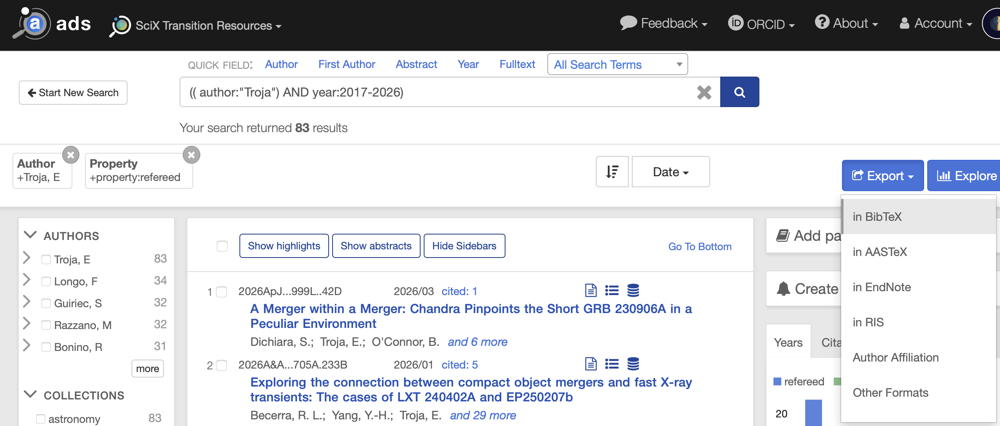

# NMonsalvesSkill

A [Claude Code](https://claude.com/claude-code) plugin with custom skills for
astrophysics research workflows. Right now it contains one skill:

- **`paper-review`** — Given a BibTeX export from SAO/NASA ADS, downloads
  every paper's PDF, extracts each Introduction, and runs analyses on them
  (first-line summaries with citations, ranking of most-cited references,
  collecting the sentences each author uses to describe the same paper).

This README is written for astronomers who are new to Claude Code. If you
already use Claude Code, jump to [Install](#install).

---

## What is Claude Code?

[Claude Code](https://claude.com/claude-code) is a terminal app from Anthropic
that lets you talk to Claude (an LLM) while it has access to the files on your
computer. You ask it to do things — read files, run scripts, analyse data —
and it does them, reporting back in the terminal.

A **skill** is a small package that teaches Claude how to perform a specific
task using scripts that come with the skill. When the skill matches what
you're asking, Claude invokes it automatically.

You will need to install Claude Code once before using this plugin. See the
[Claude Code installation page](https://docs.claude.com/en/docs/claude-code/quickstart)
for the official instructions.

## What does the `paper-review` skill do?

You give it a `.bib` file (a list of papers exported from ADS). It:

1. Downloads the arXiv PDF of every paper in the list into a folder next to
   your `.bib` (cached, so it never re-downloads).
2. Extracts the Introduction section of each paper, together with every
   citation it contains and the sentence each citation appears in.
3. Lets you ask questions like:
   - *"Give me a markdown table of the first sentence of every paper's
     introduction with the citations preserved."*
   - *"Which references are most cited across these intros?"*
   - *"Show me every sentence in the corpus that cites Abbott et al. 2017."*

You ask in plain English (or Spanish). Claude picks the analysis and runs it.

---

## Prerequisites

You need three things installed on your computer:

1. **Claude Code** — the terminal app. Install it following the official
   [quickstart guide](https://docs.claude.com/en/docs/claude-code/quickstart).
2. **Python 3.8+** — usually preinstalled on macOS and Linux. Check with
   `python3 --version`.
3. **`pdftotext`** (from the `poppler` package). This is the only non-Python
   dependency.
   - macOS: `brew install poppler`
   - Ubuntu/Debian: `sudo apt install poppler-utils`
   - Conda: `conda install -c conda-forge poppler`

No `pip install` step is needed — the skill uses only the Python standard
library.

## Install

Open a terminal and run:

```bash
# 1. Clone this repo somewhere on your machine.
git clone https://github.com/Monsalves-Gonzalez-N/NMonsalvesSkill.git ~/Claude_plugins/NMonsalvesSkill

# 2. Make Claude Code see the skill (one symlink per skill in the plugin).
mkdir -p ~/.claude/skills
ln -s ~/Claude_plugins/NMonsalvesSkill/skills/paper-review ~/.claude/skills/paper-review
```

That's it. Open Claude Code (`claude` in your terminal) — the skill is now
available. To confirm, ask Claude: *"What skills do you have available?"*
You should see `paper-review` in the list.

## Use it

### Step 1 — Export a BibTeX from ADS

1. Go to https://ui.adsabs.harvard.edu and search for the papers you want
   (e.g. by author, year range, keyword).
2. Optionally tick the checkboxes of the specific papers you want; otherwise
   the export will include the full result list.
3. Click **Export** (top-right of the result list) → **in BibTeX**.

   

4. ADS opens the BibTeX in a new tab. Save it as a `.bib` file
   (e.g. `ads_export.bib`). **Put it in its own folder** — the skill will
   create `papers_pdf/` next to it for downloaded PDFs and caches.

Example layout you should end up with:

```
~/research/short_grbs_2025/
└── ads_export.bib
```

### Step 2 — Open Claude Code in that folder

```bash
cd ~/research/short_grbs_2025
claude
```

### Step 3 — Ask

Type one of these (in English or Spanish — Claude understands both):

> Using `ads_export.bib`, build a markdown table with the first sentence of
> each paper's introduction, preserving the citations.

> From `ads_export.bib`, tell me which references are the most cited across
> all introductions.

> From `ads_export.bib`, show me every sentence that cites Troja et al. 2017
> and the paper each sentence comes from.

The first request takes a couple of minutes (Claude downloads 20-ish PDFs and
processes them). Every later request on the same `.bib` reuses the cache and
is essentially instant.

### What gets created on disk

After the first run, your folder looks like this:

```
~/research/short_grbs_2025/
├── ads_export.bib
└── papers_pdf/                       ← created automatically
    ├── _index.json                   ← maps bibkey → PDF filename
    ├── _citations.json               ← intros + per-citation sentences
    ├── Abbott2017.pdf
    ├── Troja2017.pdf
    └── ... (one PDF per paper)
```

The `papers_pdf/` folder lives next to your `.bib`, not in some global cache.
Each project keeps its own corpus.

---

## Things to know

- **Papers without an arXiv preprint are skipped.** The skill reads the
  `eprint` field of each BibTeX entry. ADS exports include this field for any
  paper that has an arXiv ID. Older or non-arXiv papers are reported in the
  log as `pdf_status: missing-eprint`.
- **arXiv rate limiting.** Downloads run with 3 parallel workers and a small
  random delay to stay under arXiv's rate limit. For a `.bib` of ~50 papers
  the first run takes a couple of minutes; after that it is instant.
- **Introduction detection.** The skill looks for the literal word
  `INTRODUCTION` in the extracted text. Papers with unusual section structure
  (rare) are skipped with `status: no-intro`.
- **Citation regex is pragmatic.** It catches `(Author et al. YEAR)`,
  `Author (YEAR)`, `Author & Other YEAR`. It has occasional false positives
  (proper nouns near 4-digit numbers); the default `--min-count 2` filters
  most of them.

## Troubleshooting

**"`pdftotext` not found"** — you didn't install poppler. See
[Prerequisites](#prerequisites).

**"Claude doesn't seem to know about the skill"** — check the symlink:
`ls -la ~/.claude/skills/paper-review` should point to
`~/Claude_plugins/NMonsalvesSkill/skills/paper-review`. If it doesn't, redo
the `ln -s` from [Install](#install).

**arXiv returns 429 (too many requests)** — wait a few minutes and re-run.
The cache will reuse anything already downloaded.

**A paper fails to download** — open the URL `https://arxiv.org/pdf/<eprint>`
in a browser to check whether it exists. Some recent submissions get
withdrawn or hidden temporarily.

## Updating

```bash
cd ~/Claude_plugins/NMonsalvesSkill
git pull
```

The symlink keeps pointing at the same location, so Claude Code picks up the
update automatically.

## License

MIT — see [`LICENSE`](LICENSE).

## Author

N. Monsalves González (`n.m.monsalvesgonzalez@gmail.com`)
